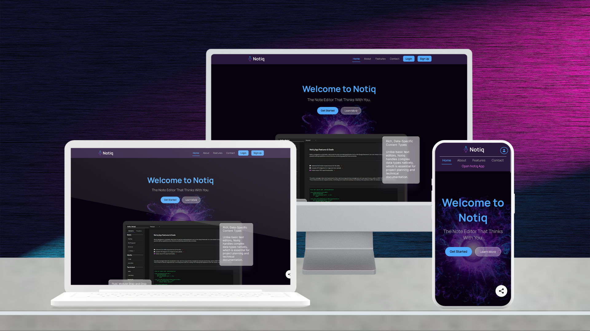
# Notiq - Full-Stack Element-Based Note Editor

## Table of Contents

1.  [Overview](#overview)
    - [Project Status](#project-status)
2.  [User Experience Design](#user-experience-design)
    - [User Interface (UI)](#user-interface-ui)
    - [Design Philosophy](#design-philosophy)
    - [Visual Consistency](#visual-consistency)
    - [Accessibility Considerations](#accessibility-considerations)
    - [Responsive Design](#responsive-design)
    - [Navigation & Usability](#navigation--usability)
    - [User Onboarding](#user-onboarding)
    - [Wireframes & Prototyping](#wireframes--prototyping)
    - [Fonts & Colors](#fonts--colors)
    - [Final Design](#final-design)
3.  [Agile Planning & Workflow](#agile-planning--workflow)
    - [Project Management](#project-management)
    - [Version Control](#version-control)
4.  [Key Features](#key-features)
    - [Main User Features](#main-user-features)
    - [Advanced Architectural Features](#advanced-architectural-features)
5.  [Technology Stack](#technology-stack)
    - [Backend and Database](#backend-and-database)
    - [Frontend and UI/UX](#frontend-and-uiux)
    - [Hosting and Services](#hosting-and-services)
6.  [Styles, Architecture & Techniques](#styles-architecture--techniques)
    - [Data Integrity: JavaScript Serialization to JSON](#1-data-integrity-javascript-serialization-to-json)
    - [Frontend Structure: Single-Page Application (SPA) Logic](#2-frontend-structure-single-page-application-spa-logic)
    - [Modular JavaScript Philosophy](#3-modular-javascript-philosophy)
7.  [Installation and Setup](#installation-and-setup)
    - [Prerequisites](#prerequisites)
    - [Local Installation](#local-installation)
    - [Deploying Notiq on Heroku](#deploying-notiq-on-heroku)
8.  [AI Implementation](#ai-integration--future-roadmap)
    - [Code Creation](#code-creation)
    - [Debugging](#debugging)
    - [Tips and Best Practices](#tips-and-best-practices)
    - [Overall Impact](#overall-impact)
9.  [AI Integration & Future Roadmap](#ai-integration--future-roadmap)
    - [Architecture for Intelligence](#architecture-for-intelligence)
    - [Proposed AI Integration Plan](#proposed-ai-integration-plan)
    - [Coming Soon Features](#coming-soon-features)
10.  [Project Context & Developer](#project-context--developer)
    - [Capstone Motivation](#capstone-motivation)
    - [Developer](#developer)
11. [Testing & Validation](#testing--validation)
12. [License](#license)
---
## Overview

Notiq is a full-stack, element-based note editor that served as the capstone project documenting my 16-week learning journey with Code Institute. This project provided an amazing opportunity to synthesize all acquired skills, resulting in a scalable and future-orientated application.
<br><br>
The project solidified my understanding of **full-stack development**, demonstrating how powerful Python and Django are for secure data handling. A key architectural achievement was the ability to **serialize complex JSON content** created on the client-side frontend and securely save it using the Django backend.
<br><br>
On the frontend, the application incorporates advanced techniques like custom **Single-Page Application (SPA) logic** for seamless navigation, **micro-animations** for an engaging user experience, and the implementation of complex **drag-and-drop features** for element reordering. Overall, Notiq showcases a deep understanding of full-stack integration, from client-side behavior to secure server-side data persistence.

### Project Status

| Status | Details |
| :--- | :--- |
| **Current Phase** | Development Complete |
| **Version** | v1.0.0 (Capstone Release) |
| **Deployment** | Heroku |
| **Live Demo** | [Visit Live Demo](https://notiq-b4efd6e13197.herokuapp.com/) |
| **Backend** | Django 4.2.x |

[↑ Back to Top](#table-of-contents)

---

## User Experience Design

### User Interface (UI)
Notiq's user interface was designed with a focus on simplicity, clarity, and ease of use. The dark theme provides a modern aesthetic while reducing eye strain during extended use. Key UI elements include a floating action button (FAB) for quick access to social links, intuitive drag-and-drop functionality for element reordering, and clear visual feedback for user interactions. Each component was carefully crafted to ensure a cohesive and engaging user experience.

<details>
  <summary>Click to view UI Screenshots</summary>

| Home Page | About Page | Features Page | Contact Page |
| :--- | :--- | :--- | :--- |
| 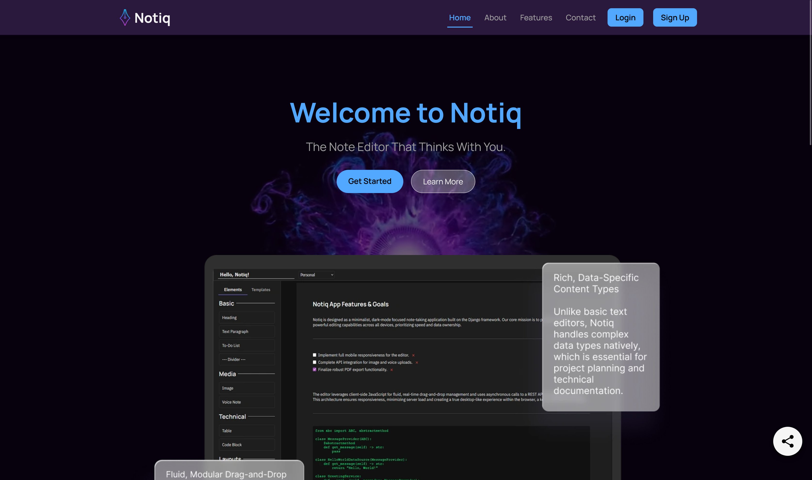 | 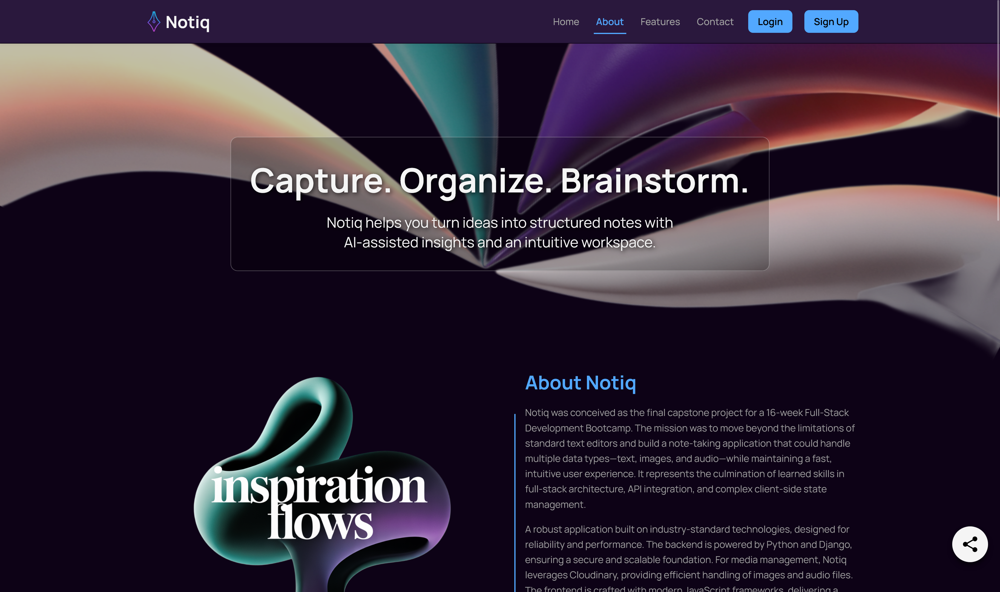 | 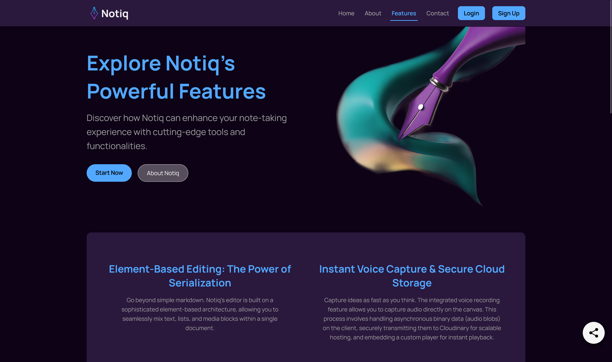 | 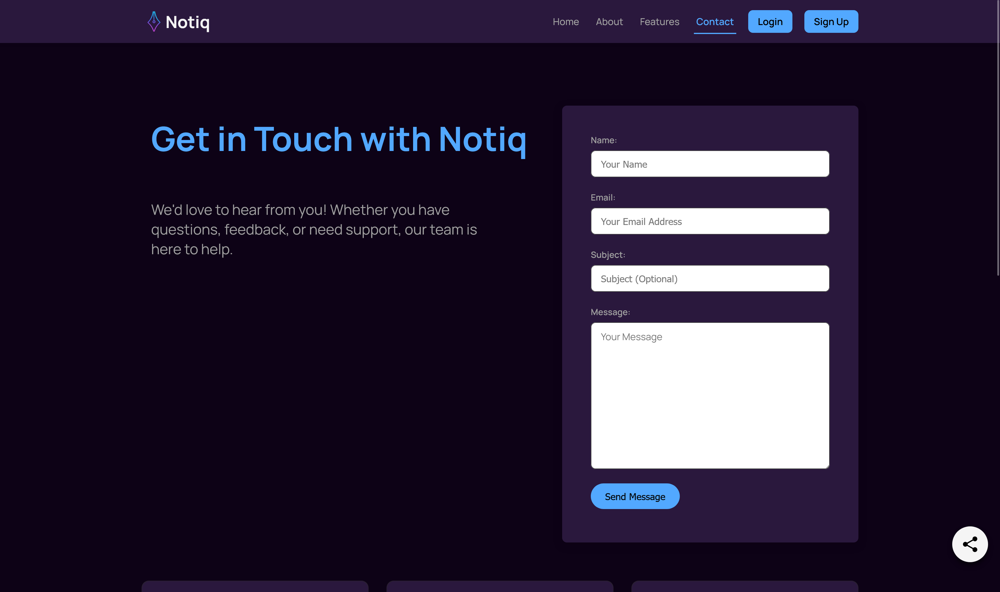 |
| Note Editor | Dropdown Menu | Drawer | Mobile View |
| 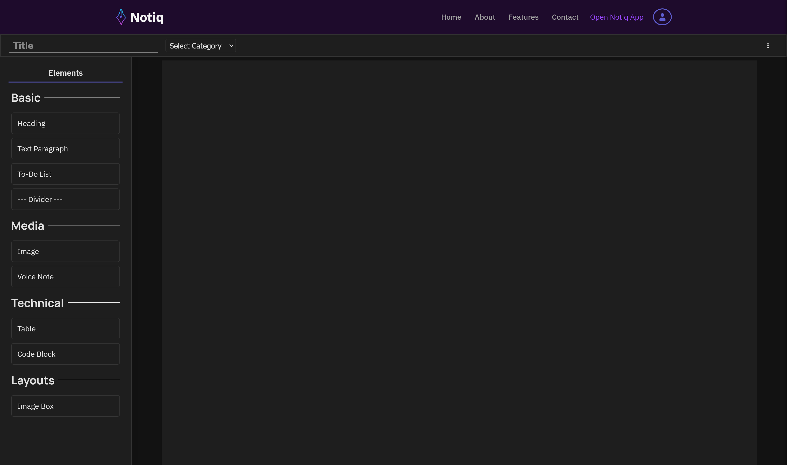 | 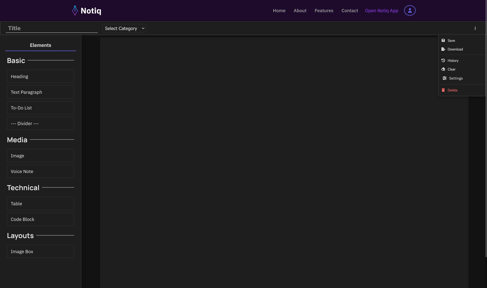 | 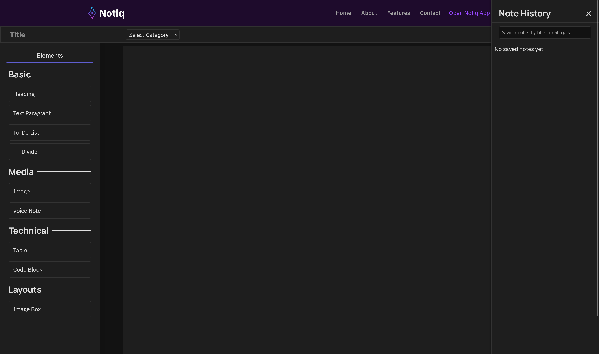 | 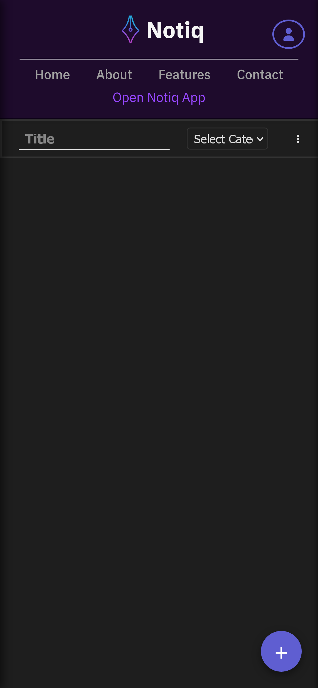 |
| Fab Links Open | Tab Component | FAQs Accordions | |
| 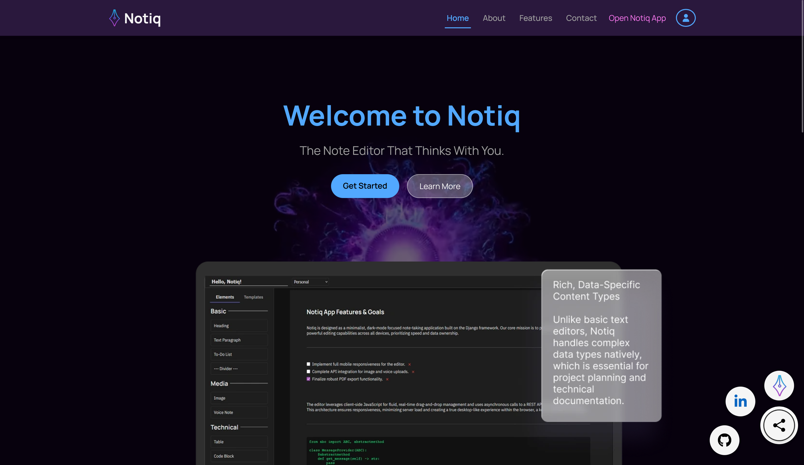 | 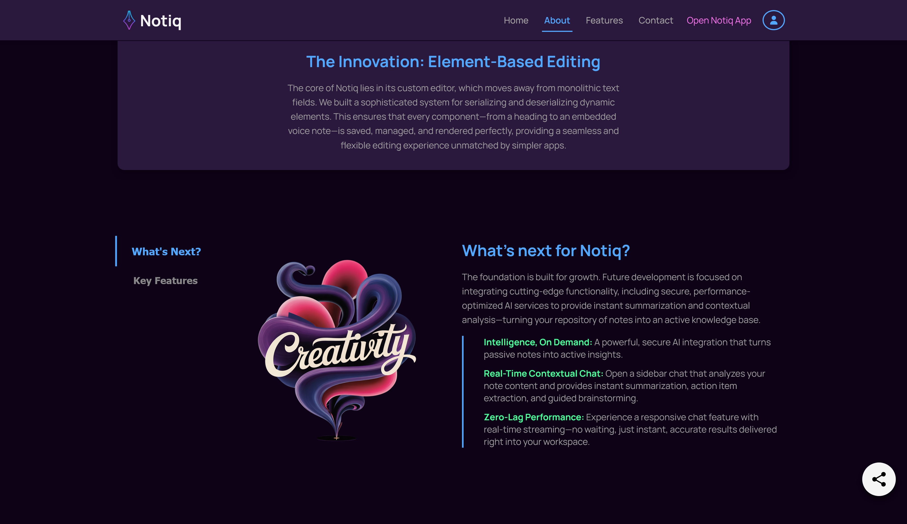 |  | |

</details>

### Design Philosophy
The design philosophy behind Notiq centers on user empowerment and flexibility. The goal was to create an environment where users can effortlessly capture and organize their thoughts without being constrained by rigid structures. By allowing users to mix text, lists, images, and audio seamlessly, Notiq encourages creativity and adaptability. The design also emphasizes accessibility and responsiveness, ensuring that users can interact with the application across various devices and screen sizes.

### Visual Consistency
Maintaining visual consistency was a priority throughout the design process. A unified color palette, typography, and iconography were employed to create a harmonious look and feel. Consistent spacing, alignment, and element sizing contribute to a polished appearance, enhancing usability and reducing cognitive load. The use of familiar UI patterns and conventions further aids in user navigation and interaction. The SPA (Single-Page Application) architecture also ensures that users experience smooth transitions and interactions without disruptive page reloads. I aimed to create a visually appealing and functionally robust application that users would find both enjoyable and efficient to use. When leaving the SPA environment, I implemented faded page transitions to maintain a cohesive user experience.

For smaller devices, I ensured that all UI elements adapt fluidly, preserving usability and aesthetics across various screen sizes. I ensured that touch targets are appropriately sized and spaced for mobile users, enhancing the overall user experience, regardless of the device being used. I introduced micro-interactions, such as button hover effects and subtle animations, to provide feedback and enhance user engagement without overwhelming the interface, and ensured that these interactions are consistent throughout the application.

Drawers and dropdowns were designed to be intuitive and accessible, allowing users to easily access additional options without cluttering the main interface. I ensured that these components are responsive and function seamlessly across different devices. Maintaining a balance between functionality and simplicity was key in the design of these interactive elements.

### Accessibility Considerations
The original color palette in mind did not meet WCAG AA contrast standards, so I adjusted colors to ensure sufficient contrast between text and background elements. This enhances readability for users with visual impairments. I implemented keyboard navigation support, allowing users to navigate through the application using only the keyboard. This includes focus indicators for interactive elements and logical tab order. 

I ensured that all interactive elements, such as buttons and links, are properly labeled with ARIA attributes where necessary. This improves screen reader compatibility and provides context for users relying on assistive technologies.

### Responsive Design
Even though the primary target audience is desktop users and was not built with mobile-first principles, I ensured that the application is fully responsive. The layout adapts seamlessly to various screen sizes, providing an optimal experience on tablets and smaller devices. I utilized CSS Flexbox and Grid to create flexible layouts that adjust based on the viewport size. Media queries were employed to fine-tune styles for different device widths, ensuring that text remains legible and UI elements are appropriately sized. I tested the application across multiple devices and browsers to ensure consistent performance and appearance.

### Navigation & Usability
The navigation structure of Notiq is designed to be intuitive and user-friendly. The primary navigation menu provides clear access to key sections of the application, including Home, About, and Features pages. Within the note editor, users can easily add, edit, and rearrange elements using straightforward controls. The floating action button (FAB) offers quick access to social links without cluttering the main interface. I ensured that all interactive elements provide visual feedback on hover and click, enhancing usability and user confidence.

### User Onboarding
AllAuth was implemented to provide a seamless user onboarding experience. New users can easily register and log in using a simple and straightforward process. I ensured that the registration form is user-friendly, with clear instructions and validation feedback. Additionally, I provided a welcoming landing page that highlights the key features of Notiq, encouraging new users to explore the application. The notiq app is only accessible to authenticated users, ensuring that user data remains private and secure, when a user tries to access the notes app without being logged in they are redirected to the login page.

Each of the Auth pages (login, signup, password reset) was customized to match the overall design aesthetic of Notiq, providing a cohesive experience from the moment users first interact with the application.

<details>
  <summary>Click to view Auth Page Screenshots</summary>

| Signup Page | Login Page | Password Reset Page |
| :--- | :--- | :--- |
| 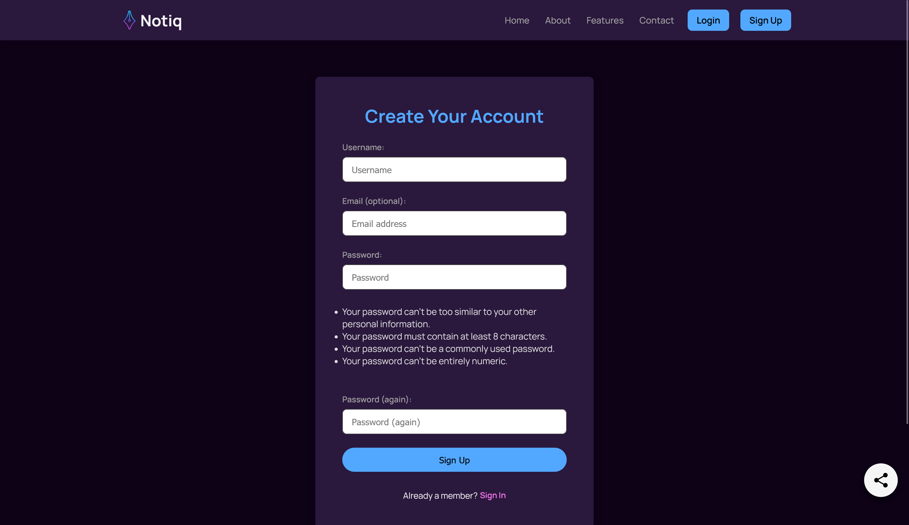 | 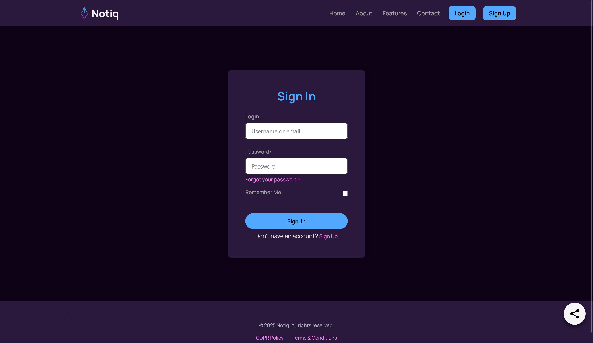 | 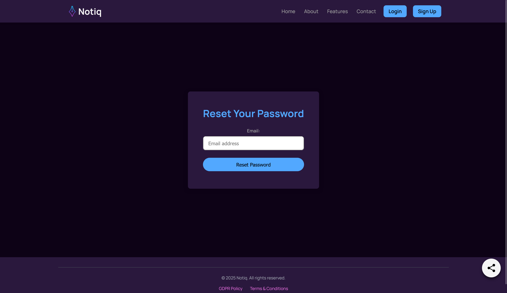 |

</details>

### Wireframes & Prototyping
Initial wireframes were created using Figma to outline the basic layout and structure of the application. These wireframes served as a blueprint for the design process, allowing for early visualization of key components and user flows. I iteratively refined the wireframes based on usability considerations and feedback, transitioning from low-fidelity sketches to high-fidelity prototypes that closely resemble the final design.

<details>
  <summary>Click to view Wireframes</summary>

| Home Page Wireframe | About Page Wireframe | Features Page Wireframe | Contact Page Wireframe |
| :--- | :--- | :--- | :--- |
| 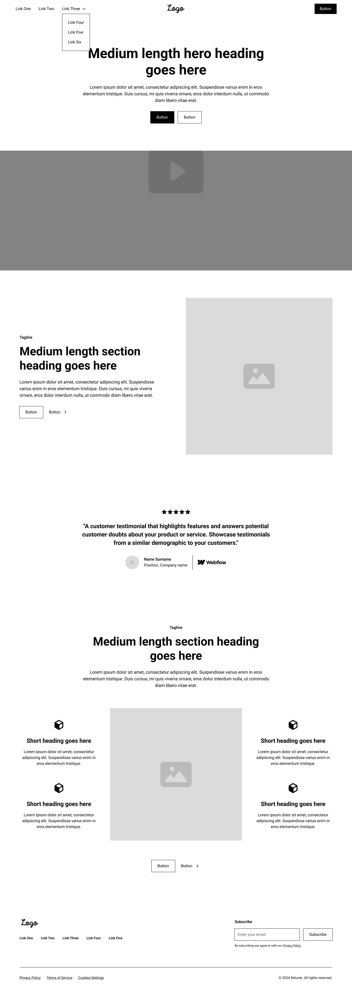 | 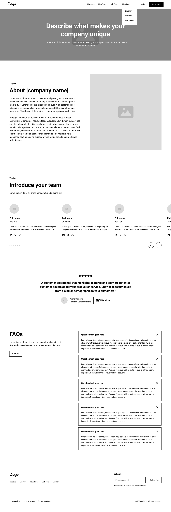 | 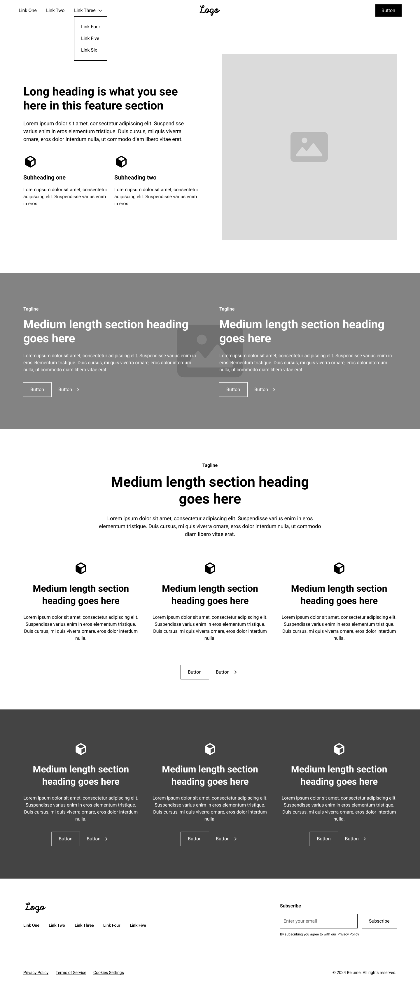 | 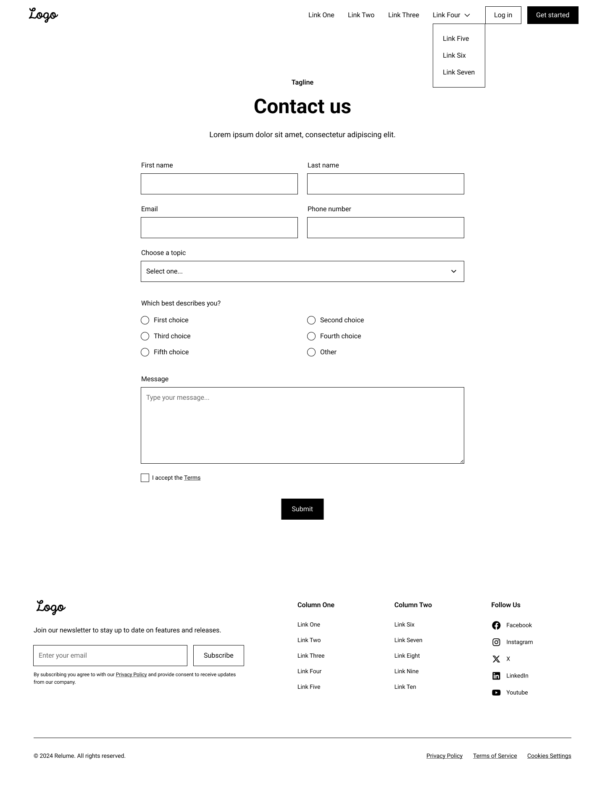 |

</details>

### Fonts & Colors
The typography choices for Notiq were made to enhance readability and align with the modern aesthetic of the application. I selected Google Fonts that provide a clean and professional look, ensuring that text is legible across various screen sizes and resolutions. Font sizes and weights were carefully chosen to create a clear hierarchy of information.

The color palette was selected to create a visually appealing and cohesive design. I utilized a combination of dark backgrounds with vibrant accent colors to highlight key elements and actions within the application. The color choices were also made with accessibility in mind, ensuring sufficient contrast for users with visual impairments.

<details>
  <summary>Click to view Font & Color Choices</summary>

| Color Palette | Visual Representation | Font Choices |
| :--- | :--- | :--- |
| 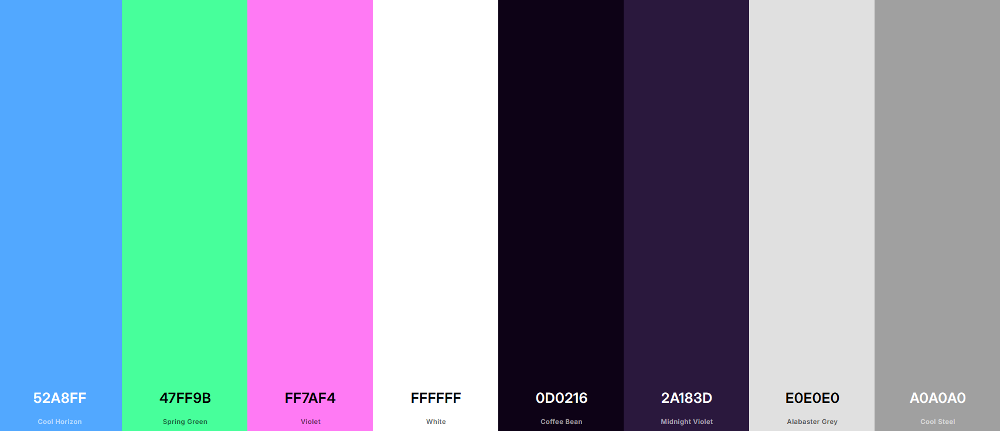 | 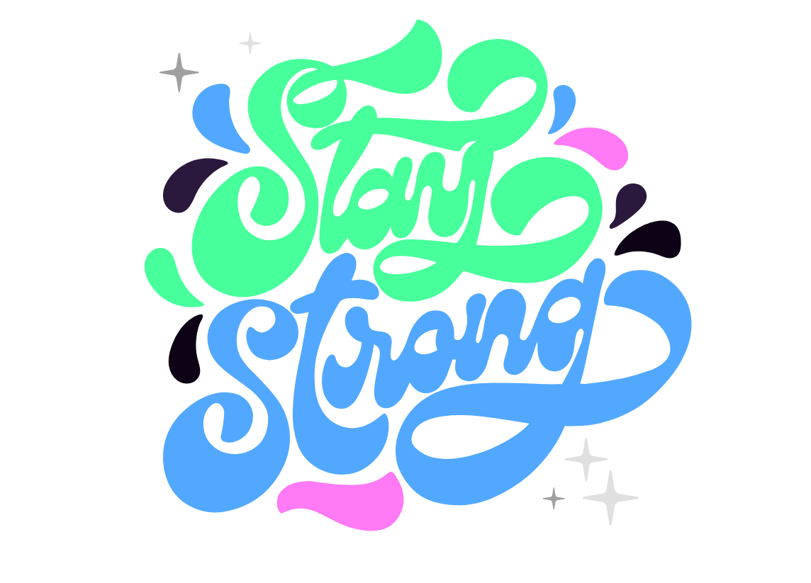 | 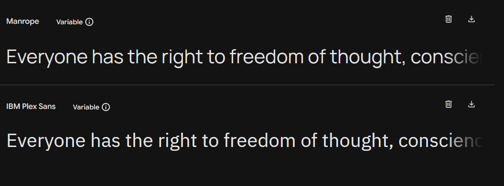 |

</details>

### Final Design
The final design of Notiq reflects a balance between aesthetics and functionality. I incorporated user feedback and usability testing results to refine the interface, ensuring that it meets the needs of the target audience. The design emphasizes clarity, ease of use, and visual appeal, creating an engaging environment for users to capture and organize their notes effectively.

[↑ Back to Top](#table-of-contents)

---

## Agile Planning & Workflow
To manage the development of Notiq effectively, I adopted an Agile planning approach, breaking down the project into manageable sprints and tasks. This methodology allowed for flexibility and iterative improvement throughout the development process. With that in mind i devided the project into the following key areas:
1. **ERD & Database Design**: I began by designing the database schema and relationships using an Entity-Relationship Diagram (ERD). This step was crucial for establishing a solid foundation for data management and ensuring that all necessary entities and their interactions were accounted for.
2. **Backend API Development**: Next, I focused on building the backend API using Django and Django REST Framework (DRF). This involved creating models, serializers, and views to handle data operations securely and efficiently. although this was done early on, I continued to refine and expand the API as new features were added.
3. **SPA Marketing Pages**: Home, About, Features, contact pages with SPA functionality, were built first to establish the overall look and feel of the application.
4. **Core App**: The core app was created and designed next, focusing on the main aspects of the web application. Holding a clear seperation within the administration panel between the marketing pages and the notes app. Features, newsletter sign-ups, legal pages and other future expansions would be added to the core app. ensuring that the functionality of the main spa pages would remain seperate and easy to manage.
5. **User Authentication**: Implemented user registration, login, and authentication using Django AllAuth to secure access and prepare for the development of the notes app.
6. **Note Editor App**: I ensured that the notes editor app was developed in isolation from the rest of the application, This approach was crucial for maintaining a clean architecture and allowing for future scalability. If needed, the notes app could be extracted and integrated into other projects without significant refactoring.


### Project Management
MoSCoW prioritization was used to categorize features and tasks into Must have, Should have, Could have, and Won't have for this release. This helped in focusing on essential functionalities first while allowing flexibility for additional features based on time and resources. I utilized GitHub Projects to create a Kanban board that visually represented the workflow. Tasks were organized into columns such as Backlog, To Do, In Progress, and Done. This structure facilitated clear tracking of progress and ensured that tasks moved smoothly through the development pipeline.

[Link to GitHub Project Board](#)

### Version Control
Git was used for version control, with a branching strategy that included a main branch for stable releases and feature branches for individual tasks. This approach allowed for isolated development and easy integration of new features. Regular commits with descriptive messages were made to document progress and changes effectively.

[↑ Back to Top](#table-of-contents)

---

## Key Features

Notiq was designed to challenge the limits of a traditional text editor, focusing on user experience, data integrity, and architectural complexity.

### Main User Features

These are the primary features that define the user experience and showcase advanced frontend capabilities:

| Feature | Description | Technical Showcase |
| :--- | :--- | :--- |
| **Dynamic, Element-Based Editor** | Go beyond simple text. Seamlessly mix text, custom lists, and rich media blocks on a single, flexible canvas. | Complex **DOM manipulation** and custom **client-side state management** using Vanilla JS. |
| **Instant Voice Capture** | Instantly record and embed audio memos directly into your notes. Perfect for quickly capturing meeting notes or thoughts on the go. | Integration of the browser's **MediaRecorder API**, handling **asynchronous binary data** (audio blobs). |
| **Drag and Drop Reordering** | Intuitively move and reorder any note element across the canvas. | Advanced **JavaScript event handling** (`mousedown`, `mousemove`) linked directly to **serialization update logic**. |
| **Cohesive SPA Experience** | Enjoy instant navigation between the marketing pages (Home, About, Features) without full page reloads. | Custom implementation of the **History API (`pushState`)** and **Fetch API** for routing and content loading. |

### Advanced Architectural Features

These features detail the technical complexity and robustness of the backend architecture:

| Feature | Description | Technology/Concept |
| :--- | :--- | :--- |
| **Custom Data Serialization** | The editor state is reliably saved by serializing the complex JavaScript object structure into a single, cohesive **JSON string** for database storage. | **JSON Serialization** and **Deserialization** between the client-side editor and the Django model. |
| **Full-Stack Decoupling** | The frontend and backend operate independently: Django provides the API/data, and Vanilla JS manages the UI/state. | **RESTful API Design** using Django Patterns, promoting **scalability and maintainability**. |
| **Secure Cloud Asset Management** | All media (images and audio files) are offloaded from the Django server to ensure high availability and performance. | **Third-Party API Integration** with **Cloudinary** for scalable, secure file hosting. |

[↑ Back to Top](#table-of-contents)

---

## Technology Stack

Notiq is built on a robust, industry-standard **full-stack architecture**. The technologies chosen prioritize **security, performance, and scalability** to ensure the application is production-ready.

### Backend and Database

| Component | Technology | Rationale and Implementation |
| :--- | :--- | :--- |
| **Primary Language** | **Python** | Chosen for its clear syntax, readability, and extensive ecosystem, making complex backend logic manageable. |
| **Web Framework** | **Django** | Used for its "batteries-included" philosophy, providing rapid development tools for the ORM, authentication, and core routing. |
| **API Layer** | **Django REST Framework (DRF)** | Utilized to build custom, secure **RESTful API endpoints** for handling complex note serialization and data retrieval (e.g., handling the JSON payload from the editor). |
| **Authentication** | **Django AllAuth** | Implemented for robust user authentication, registration, and session management, ensuring secure access to user-specific notes. |
| **Lucid ERD Tool** | **Lucidchart** | Used to design the database schema and relationships visually before implementation, ensuring a well-structured data model. |
| **Database** | **PostgreSQL (or SQLite for development)** | A powerful, reliable, and production-grade relational database, suitable for managing the serialized JSON data with integrity. |

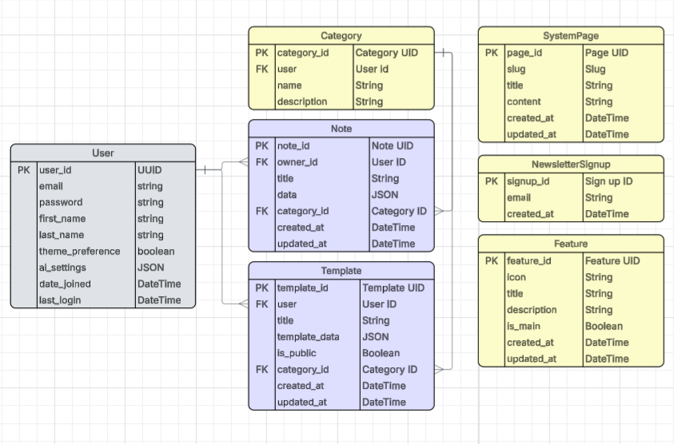

### Frontend and UI/UX

| Component | Technology | Rationale and Implementation |
| :--- | :--- | :--- |
| **Core UI** | **Vanilla JavaScript** | Chosen to demonstrate mastery of core web technologies and to build a custom, high-performance **Single-Page Application (SPA)** framework without the overhead of external libraries. |
| **Structure/Style** | **HTML5 / CSS3** | Provides the foundation and styling, including custom layouts and the implementation of advanced CSS features like transitions and variables. |
| **Typography** | **Google Fonts** | Used to ensure a consistent, appealing typeface across the application. |
| **Icons** | **Font Awesome & Ion-Icons** | Using both libraries shows versatility in integrating different external assets for scalable vector iconography. |
| **Image Creation** | **Picsart** | Utilized for the design and editing of all static marketing and hero images within the application. |
| **Prototyping & Wireframing** | **Figma** | Employed for initial wireframing and high-fidelity prototyping to plan the user interface and experience before development. |
| **Color Palette Tool** | **Coolors** | Used to generate and refine the color scheme, ensuring visual harmony and accessibility compliance. |

### Hosting and Services

| Component | Technology | Rationale and Implementation |
| :--- | :--- | :--- |
| **Media Storage** | **Cloudinary** | Integrated for secure, scalable, and high-availability storage of all user-generated media (voice notes and images), offloading file hosting from the main application server. |
| **Deployment** | **Heroku** | Used for flexible and rapid deployment, serving as the primary hosting environment for the final capstone project. |

[↑ Back to Top](#table-of-contents)

---

## Styles, Architecture & Techniques

This project was built not just for functionality, but for **maintainability, scalability, and performance**. The following architectural decisions and techniques were implemented to ensure the application is robust and provides a cohesive user experience.

### 1. Data Integrity: JavaScript Serialization to JSON

The core of Notiq's flexibility lies in its approach to data storage.

* **Technique:** Instead of saving notes as simple Markdown or HTML, the entire note canvas state is dynamically represented in the browser as a complex **JavaScript object** (containing element types, content, and ordering).
* **Serialization:** This object is converted (serialized) into a **single JSON string** before being sent to the Django API and stored in the database.
* **Benefit:** This method guarantees **data integrity** by preserving the exact structure, element type, and ordering of the note, enabling complex features like **Drag and Drop** and **Voice Note** embedding. When the note is loaded, the JSON is deserialized back into active DOM elements.

### 2. Frontend Structure: Single-Page Application (SPA) Logic

Notiq implements a custom, high-performance **Single-Page Application (SPA)** architecture using **Vanilla JavaScript** to deliver a fast, app-like experience without external frameworks.

* **Logic Flow:** When a user clicks an internal link (e.g., to the About or Features page), **Vanilla JavaScript intercepts the click event** (`e.preventDefault()`). The script uses the **Fetch API** to retrieve only the new page content (HTML fragments) from the Django backend.
* **History Management:** The **History API (`window.history.pushState`)** is used to update the URL in the address bar. This ensures the browser's back and forward buttons work as expected, maintaining the illusion of a traditional multi-page application.
* **Cohesive UX: Faded Page Transitions:** To visually confirm the page change and enhance the professional feel, a specific transition effect was implemented. The **old content is quickly faded out** using a CSS opacity transition, and the new content fades in. This minimizes jarring flashes and provides a fluid, polished experience.

### 3. Modular JavaScript Philosophy

The JavaScript logic is intentionally split into dedicated files to enforce **modularity, separation of concerns, and future portability**, rather than being contained within one monolithic script.

#### Marketing Pages & General UI (Shared Logic)

| File Name | Primary Logic Encapsulated | Rationale |
| :--- | :--- | :--- |
| **`spa.js`** | Core **Single-Page Application (SPA) routing logic**, managing the History API and URL changes. | Centralizes all routing for seamless marketing page navigation. |
| **`components.js`** | Logic for reusable UI elements: **tabs, logo tracking, glowing cards**, and other visual micro-interactions. | Ensures UI behavior is decoupled from core routing and business logic. |
| **`fab.js`** | **Floating Action Button (FAB) toggles** and specific menu behavior. | Isolates complex radial menu interaction scripts. |
| **`forms.js`** | Form submission and validation logic, specifically used for the **newsletter sign-up form**. | Separates form submission from general page behavior. |
| **`page-transition.js`** | Handles the **faded transition effects** for pages outside of the SPA environment. | Ensures a cohesive UX across all page loading types. |

#### Notes App Logic (Portable & Extensible)

The notes editor application features a highly modular internal structure, designed so the entire editor environment can be **easily extracted and implemented in future projects**.

| File Name | Primary Logic Encapsulated | Rationale |
| :--- | :--- | :--- |
| **`notes-script.js`** | The **main notes script** that initializes the editor, registers event listeners, and orchestrates the other notes-specific scripts. | Serves as the single entry point for the note editor application. |
| **`utils.js`** | Helper functions for general use within the editor (e.g., DOM manipulation, element ID generation). | Provides a repository of pure functions for editor operations. |
| **`save-notes.js`** | Contains the functions responsible for **serializing the canvas data to JSON** and sending the payload to the Django API. | Isolates critical data saving and communication logic. |
| **`load-notes.js`** | Contains the functions responsible for **fetching the JSON payload** from the backend and **deserializing** it into active DOM elements upon load. | Separates retrieval and render logic from saving logic. |
| **`history.js`** | Logic for handling local undo/redo stacks or tracking version history within the editor. | Encapsulates non-persistence related state management. |

[↑ Back to Top](#table-of-contents)

---

## Installation and Setup

### Prerequisites
Before deploying Notiq locally, ensure you have the following on your machine:
- **Python 3.12.x**: [Download Python](https://www.python.org/downloads/)
- **Pip**: Python package manager (usually included with Python installations)
- **Virtual Environment**: Recommended for managing dependencies (e.g., `venv` or `virtualenv`)
- **Git**: For cloning the repository ([Download Git](https://git-scm.com/downloads))
- **PostgreSQL**: For production-like database setup (optional, SQLite can be used for development)
- **Cloudinary Account**: For media storage (optional, can be configured later)

### Local Installation

<details>
  <summary>Click to view step-by-step local installation instructions</summary>

1. **Clone the Repository**
   ```bash
   git clone https://github.com/your-username/notiq.git
   ```
2. **Navigate to the Project Directory**
   ```bash
   cd notiq
   ```
3. **Create and Activate a Virtual Environment**
   ```bash
    python -m venv .venv
    source .venv/bin/activate  (On Windows: source .venv\Scripts\activate)
    ```
4. **Install Dependencies**
   ```bash
   pip install -r requirements.txt
   ```
5. **Set Up Environment Variables**
    Create a `.env` file in the root directory and add the following variables:
    ```
    SECRET_KEY=your_django_secret_key
    DEBUG=True
    DATABASE_URL=your_database_url
    CLOUDINARY_URL=your_cloudinary_url
    ```
6. **Apply Database Migrations**
   ```bash
   python manage.py migrate
   ```
7. **Create a Superuser (Optional)**
   ```bash
    python manage.py createsuperuser
    ```
8. **Run the Development Server**
    ```bash
    python manage.py runserver
    ```
9. **Access the Application**
    Open your web browser and navigate to `http://localhost:8000`

Enjoy exploring Notiq locally!

</details>

### Deploying Notiq on Heroku

<details>
  <summary>Click to view step-by-step Heroku deployment instructions</summary>

**Note:** Make sure you have a Heroku account and have forked this repository.
1. **Login to Heroku** at -> https://id.heroku.com/login
   
2. **Create a New Heroku App**
    - Use the Heroku dashboard to create a new application.
    - Click on "New" -> "Create new app"
    - Give it a unique name, and select your region.

    | Step 1 | Step 2 | Step 3 |
    | :--- | :--- | :--- |
    | 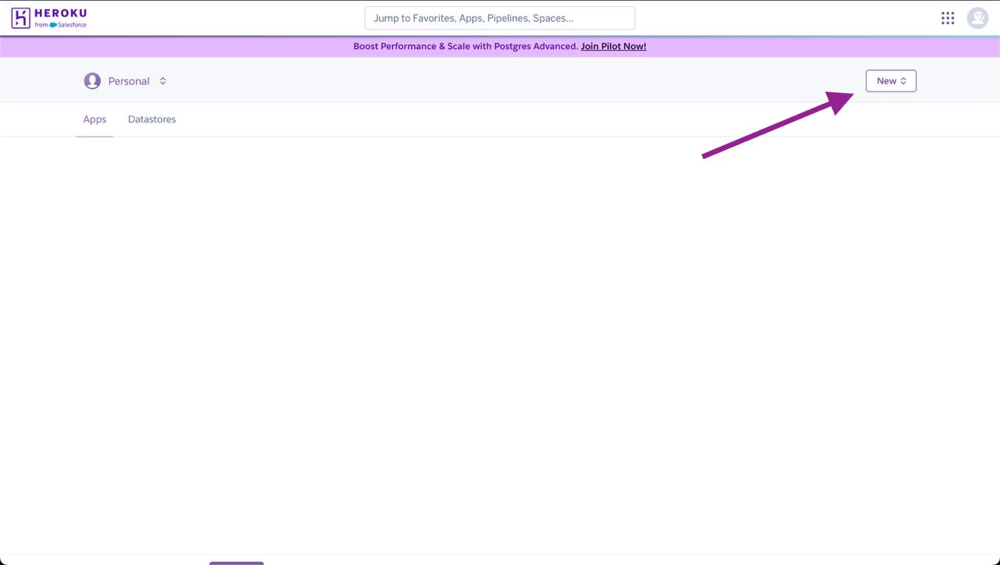 | 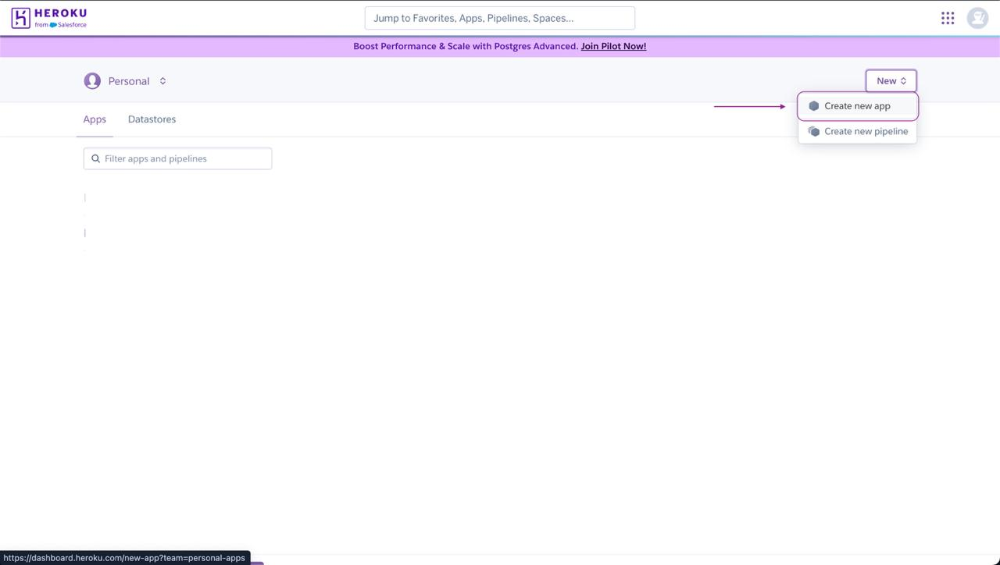 | 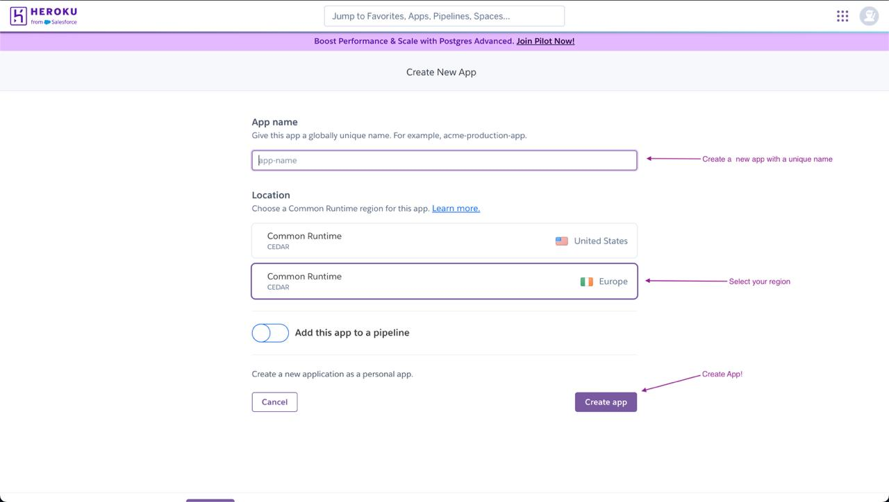 |
   
3. **Link your Github with Heroku**
    - In the "Deploy" tab of your Heroku app, select "GitHub" as the deployment method.
    - Search for your forked repository and connect it.

    | Step 4 |
    | :--- |
    |  |

4. **Configure Environment Variables**
    - In the "Settings" tab, click on "Reveal Config Vars".
    - Add the necessary environment variables as per your `.env` file.

    | Step 5 | Step 6 |
    | :--- | :--- |
    | 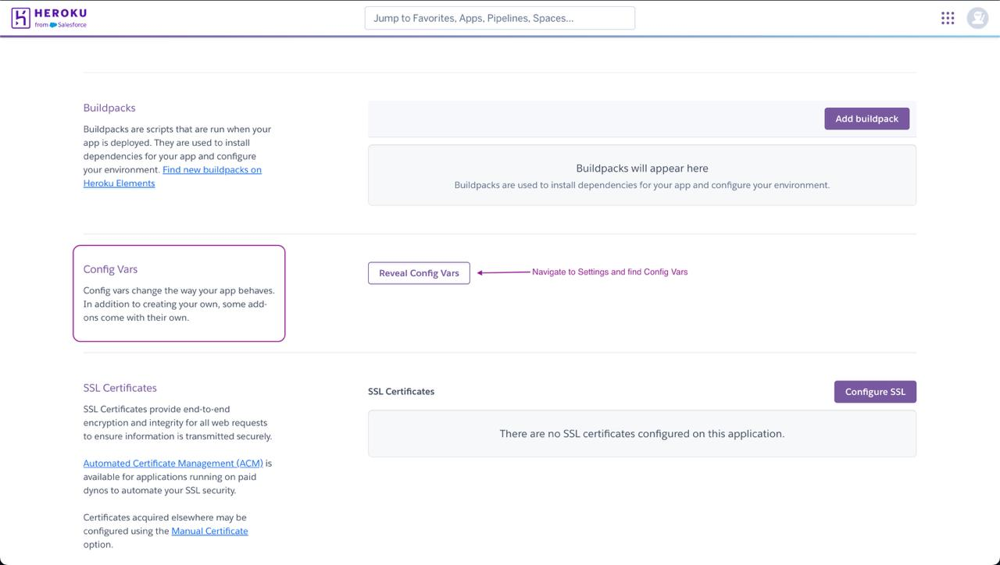 | 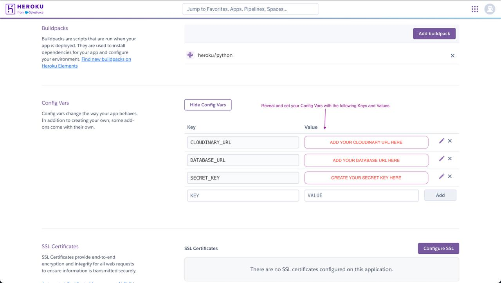 |

5. **Deploy the Application**
    - In the "Deploy" tab, scroll down to "Manual deploy".
    - Select the branch you want to deploy, ensure you are deploying the `main` branch, and click "Deploy Branch".

    | Step 7 |
    | :--- |
    | 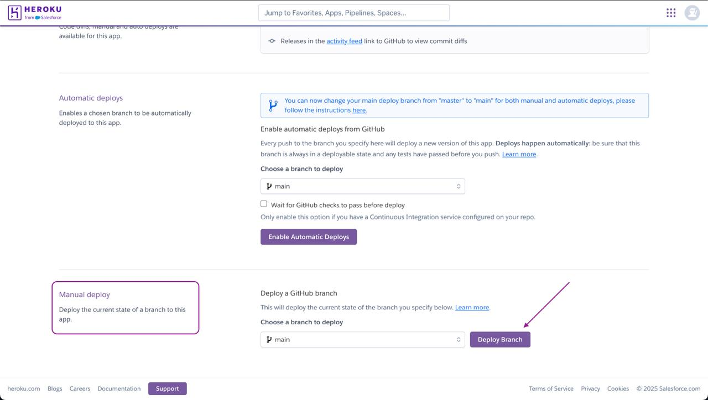 |

6. **Open the Application**
    - Once the deployment is complete, click on "View" to open your live Notiq application.

Enjoy using Notiq on Heroku!

</details>

[↑ Back to Top](#table-of-contents)

---

## AI Implementation

### Code Creation
AI was used to help generate boilerplate code for repetitive tasks, such as setting up Django models, serializers, and views. This significantly sped up the initial development phase. During this process, I ensured to review and modify the generated code to fit the specific needs of the project. Even though AI provided great code snippets it did not understand the full context of the application nor did it plan ahead, so I had to ensure that the code integrated well with the existing architecture. This involved checking for consistency with naming conventions, data structures, and overall design patterns used throughout the project. Many times I found that the AI-generated code required adjustments to align with the project's specific requirements and best practices. In some cases, I had to refactor the code to improve efficiency or readability.

### Debugging
AI was also utilized for debugging assistance. When encountering errors or unexpected behavior, I would describe the issue to the AI and receive suggestions on potential causes and solutions. This was particularly helpful for complex bugs that were difficult to trace. However, I always verified the suggestions provided by the AI through my own testing and debugging processes. While AI can offer valuable insights, it may not always have the full context of the application or understand the nuances of specific frameworks or libraries being used. Therefore, I treated AI-generated debugging advice as a starting point rather than a definitive solution, ensuring that any changes made were thoroughly tested to confirm they resolved the issue without introducing new problems.

### Tips and Best Practices
To effectively leverage AI in the development process, I followed several best practices:
1. **Clear Prompts:** I provided detailed and specific prompts to the AI, including relevant context about the project, the technologies being used, and the specific problem I was trying to solve. This helped generate more accurate and useful responses.
2. **Iterative Refinement:** I treated AI-generated code and suggestions as drafts that could be refined. I iteratively improved upon the AI's output, ensuring it met the project's standards and requirements.
3. **Critical Review:** I maintained a critical eye when evaluating AI-generated content. I cross-checked suggestions against official documentation and best practices to ensure accuracy and reliability.

### Overall Impact
The integration of AI into the development process of Notiq had a significant positive impact. It accelerated the coding and debugging phases, allowing me to focus more on higher-level design and architecture decisions. The AI served as a valuable tool for generating boilerplate code and providing debugging insights, ultimately contributing to a more efficient development workflow. I greatly relied on AI as a search and assistance tool. However, it was crucial to maintain a critical eye and ensure that all AI-generated content was thoroughly reviewed and tested to ensure it met the project's standards and requirements.


[↑ Back to Top](#table-of-contents)

---

## AI Integration & Future Roadmap

While the integration of a Large Language Model (LLM) is scoped for a post-capstone release, the entire application architecture was built with this expansion as a core consideration. The current setup, featuring an isolated Notes App and a preparatory database model, makes this transition seamless.

### Architecture for Intelligence

The project is already primed for the addition of AI services due to two key architectural decisions:

1.  **Custom User Model:** The application's custom Django User model already includes an **`ai_preferences` field**. This is reserved for managing user-specific AI settings, such as enabling/disabling features, selecting a preferred model, or storing usage tokens. This ensures that AI features can be managed granularly at the user level without requiring major database migrations later.
2.  **Isolated Notes App:** The entire note editing logic is contained within its own set of modular JavaScript files and Django views. This isolation means the AI features can be developed and hooked directly into the editor's saving and processing pipeline **without modifying the core marketing or authentication logic.**

### Proposed AI Integration Plan

The primary benefit of integrating an LLM will be to transform raw notes into actionable, structured content. We plan to integrate a model (such as a private instance of Llama 4 Scout or a secure cloud service) through a secure server-side proxy.

| Feature Name | Description | Benefit to User |
| :--- | :--- | :--- |
| **Note Summarization** | A button that processes the entire note's serialized JSON content and generates a concise, actionable summary. | Saves time by extracting the most critical information from long meetings or research documents. |
| **Action Item Extraction** | The AI scans the note content for verbs and context, automatically listing and formatting potential **actionable tasks**. | Converts unstructured meeting minutes into immediate, organized to-do lists. |
| **Tone and Clarity Refinement** | The user can highlight a section and ask the AI to rephrase it to be more professional, clearer, or longer. | Improves communication quality and aids in drafting formal documents. |
| **Voice Note Transcription** | Upon saving a voice element, the AI service transcribes the audio into editable text, which is then saved alongside the note's JSON. | Provides accessibility and full-text search capabilities for audio content. |

### Coming Soon Features

The following features are potential improvements that did not make the initial 3 week development release, but can be planned for future updates:

* **Offline Support:** Implement **service workers** to allow users to view and edit notes while disconnected from the internet.
* **Real-time Collaboration:** Introduce **WebSockets** for basic, real-time shared editing functionality.
* **Version History:** Fully implement the version history feature (using the existing `notes_history.js` framework) to allow users to roll back to previous saved states.
* **Enhanced Media Support:** Expand media capabilities to include video embedding and basic editing tools (cropping, trimming).
* **Dark Mode Toggle:** Provide users with the option to switch between light and dark themes for improved accessibility and user preference.
* **Folder Organization:** Allow users to create folders and categorize notes for better organization and retrieval.
* **Template Library:** Introduce a library of pre-designed note templates for various use cases (meeting notes, project planning, personal journaling).
* **AI Implementation:** As detailed above, integrate AI features for summarization, action item extraction, and tone refinement.
* **Custom Styling Options:** Enable users to customize fonts, colors, and layouts within their notes for a personalized experience.

[↑ Back to Top](#table-of-contents)

---

## Project Context & Developer

### Capstone Motivation

Notiq serves as the final **Capstone Project** for my **16-week Full-Stack Software Development Bootcamp** with **Code Institute**.

The motivation behind this project was to push beyond the standard requirements of a CRUD application. I wanted to challenge myself to build a tool that I would actually want to use, a note editor that feels modern, fast, and flexible. This project provided the perfect opportunity to synthesize everything I've learned, from **Django backend security** to advanced **JavaScript DOM manipulation**, and to explore new concepts like **SPA architecture** and **complex data serialization**.

It stands as a testament to my growth as a developer, showcasing my ability to tackle architectural complexity, manage full-stack state, and deliver a polished user experience.

### Developer

**Blaise Smyka**

* **GitHub:** [github.com/Blaisesa](https://github.com/Blaisesa)
* **LinkedIn:** [linkedin.com/in/blaise-smyka](https://www.linkedin.com/in/blaise-smyka/)

[↑ Back to Top](#table-of-contents)

---

## Testing & Validation
| Test Category | Test Case | Status |
| :--- | :--- | :--- |
| **Frontend - Editor** | Element creation and deletion | Pass |
| **Frontend - Editor** | Drag and drop reordering | Pass |
| **Frontend - Editor** | Voice recording and playback | Pass |
| **Frontend - Editor** | Text and list formatting | Pass |
| **Frontend - SPA** | Navigation between marketing SPA pages | Pass |
| **Frontend - SPA** | History API back/forward buttons | Pass |
| **Frontend - SPA** | Page transition animations | Pass |
| **Frontend - UI/UX** | Responsive design on mobile devices | Pass |
| **Frontend - UI/UX** | Responsive design on tablets | Pass |
| **Frontend - UI/UX** | Responsive design on desktop | Pass |
| **Frontend - Accessibility** | WCAG AA contrast standards | Pass |
| **Frontend - Accessibility** | Keyboard navigation | Pass |
| **Backend - API** | Note creation endpoint | Pass |
| **Backend - API** | Note retrieval endpoint | Pass |
| **Backend - API** | Note update endpoint | Pass |
| **Backend - API** | Note deletion endpoint | Pass |
| **Backend - API** | JSON serialization/deserialization | Pass |
| **Backend - Authentication** | User registration | Pass |
| **Backend - Authentication** | User login | Pass |
| **Backend - Authentication** | User logout | Pass |
| **Backend - Security** | CSRF protection | Pass |
| **Integration** | Cloudinary media upload | Pass |
| **Integration** | Cloudinary media retrieval | Pass |
| **Performance** | Page load time | Pass |
| **Performance** | Editor responsiveness | Pass |
| **Cross-Browser** | Chrome compatibility | Pass |
| **Cross-Browser** | Firefox compatibility | Pass |
| **Cross-Browser** | Safari compatibility | Pass |
| **Cross-Browser** | Edge compatibility | Pass |
| **Admin Interface Tests** | Note management in Django admin | Pass |
| **Admin Interface Tests** | User management in Django admin | Pass |
| **Admin Interface Tests** | Media management in Django admin | Pass |
| **Admin Interface Tests** | Permission enforcement in Django admin | Pass |
| **Integration Tests** | Frontend-backend note retrieval | Pass |
| **Integration Tests** | Frontend-backend note updating | Pass |
| **Integration Tests** | Frontend-backend note deletion | Pass |
| **Integration Tests** | Frontend-backend note creation | Pass |
| **Integration Tests** | Frontend-backend note saving | Pass |
| **Integration Tests** | Frontend-backend note loading | Pass |
| **Integration Tests** | Frontend-backend API communication | Pass |
| **Integration Tests** | Frontend-backend communication | Pass |
| **Integration Tests** | Frontend-backend data flow | Pass |
| **Integration Tests** | End-to-end note creation and retrieval | Pass |
| **User Acceptance Testing (UAT)** | Overall user experience and functionality | Pass |
| **Validation Tests** | HTML validation | Pass |
| **Validation Tests** | CSS validation | Pass |

### Python Linter Reports

<details>
  <summary>Click to view Pylint Reports</summary>

| Section | Status | Proof |  |
| :--- | :--- | :--- | :--- |
| Models | Pass | Accounts, Core, Notes Screenshots |  |
| 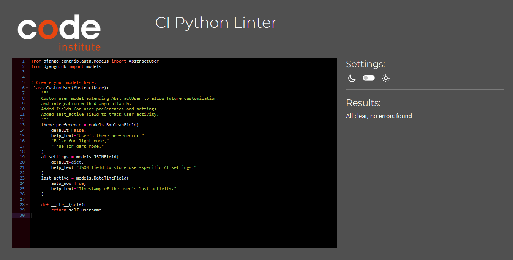 | 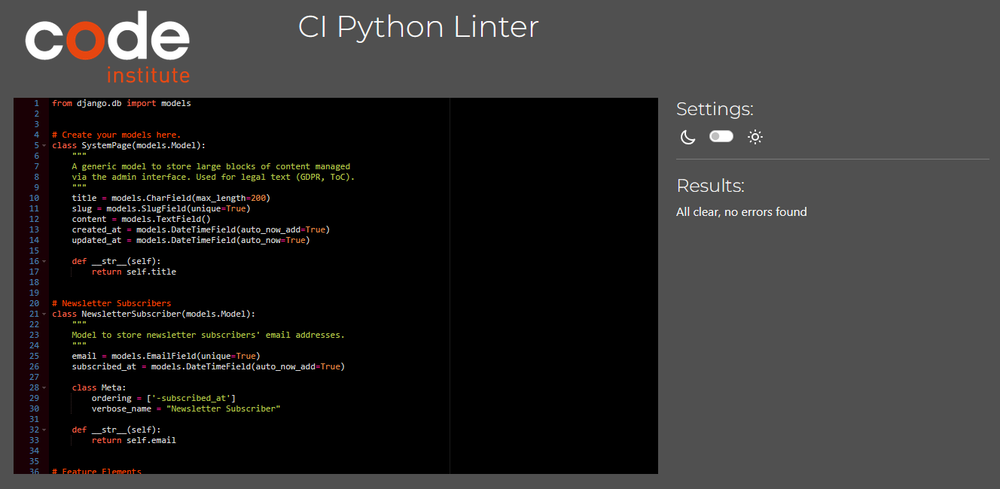 | 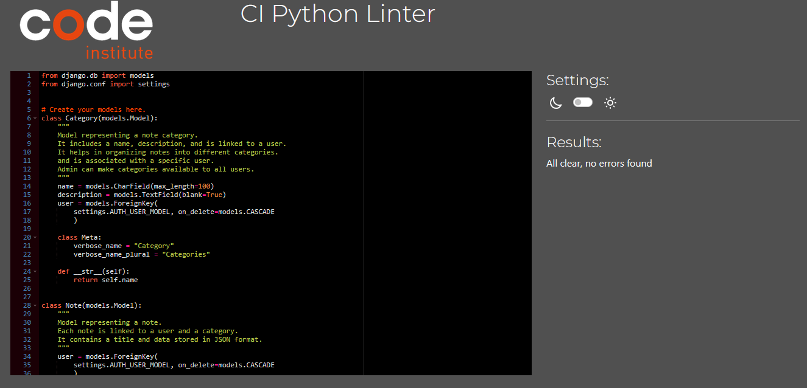 |
| Views | Pass | Accounts, Core, Notes, SPA Screenshots |  |
| 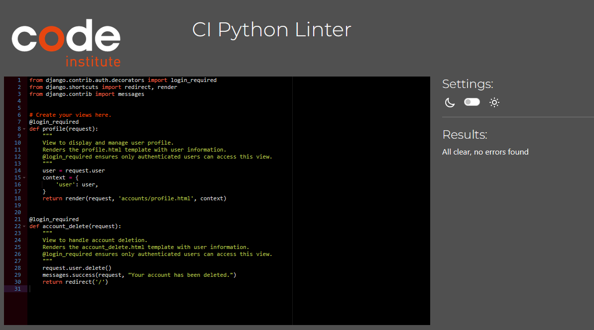 | 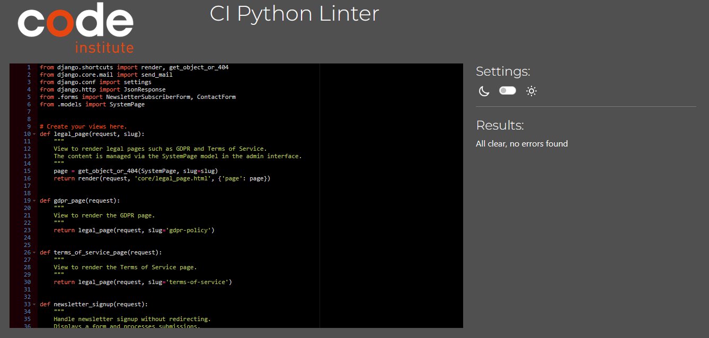 | 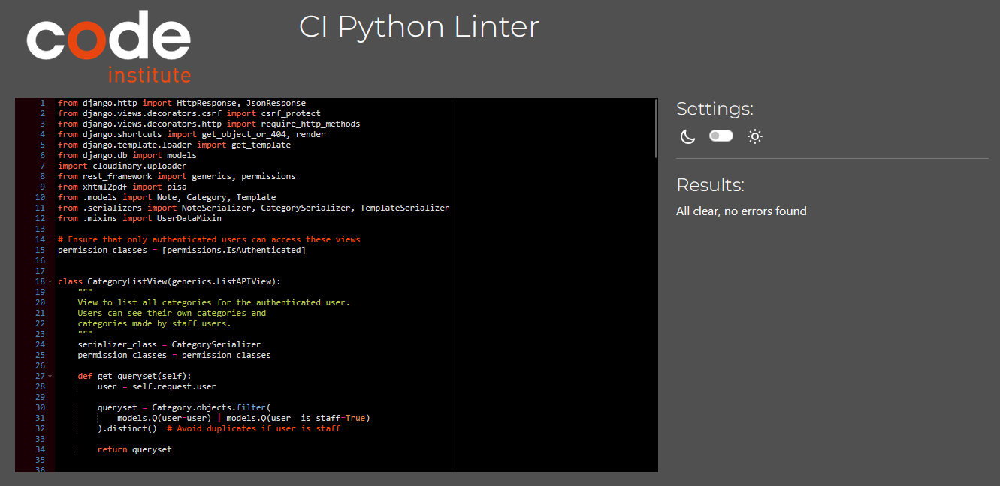 | 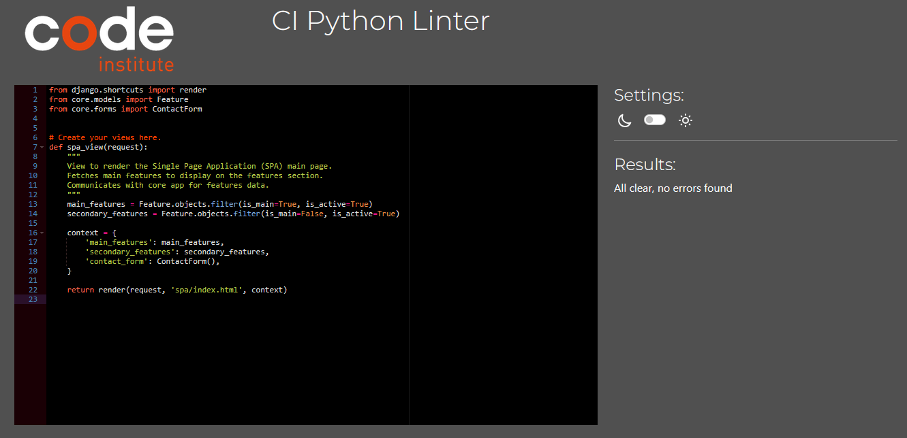 |
| Admin, Serializers & Mixins | Pass | Notes & Core Screenshot |
| 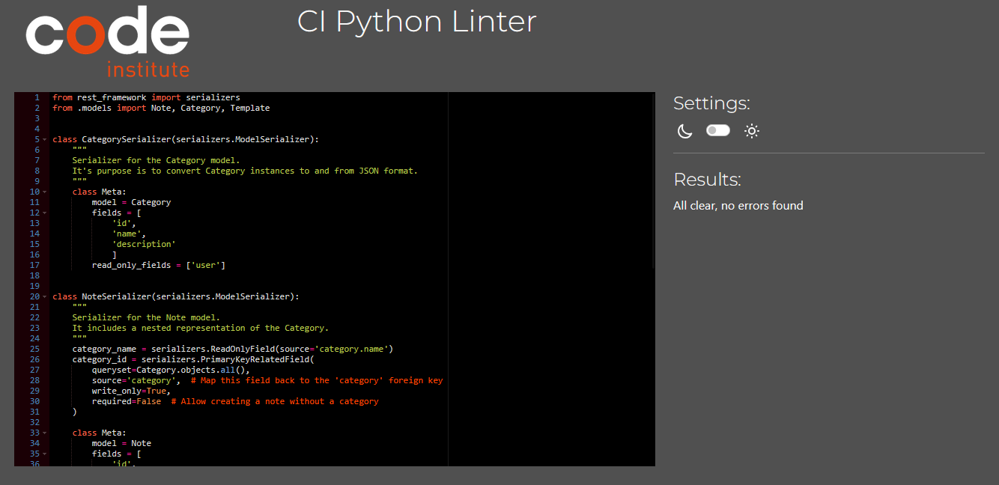 | 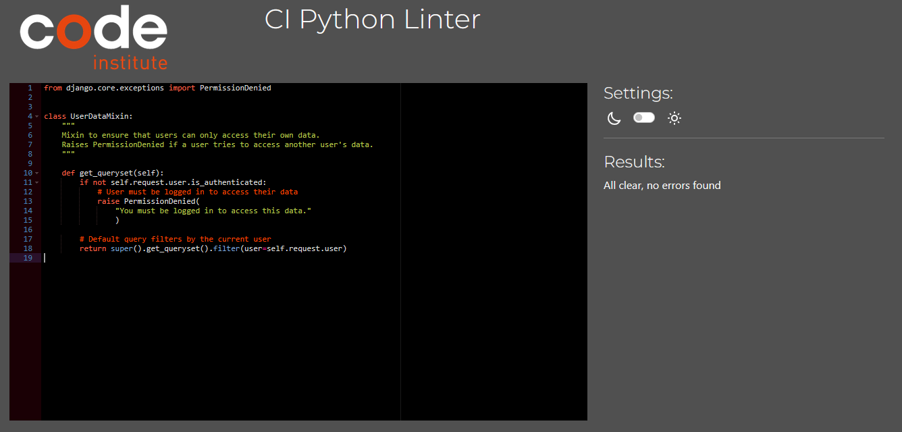 | 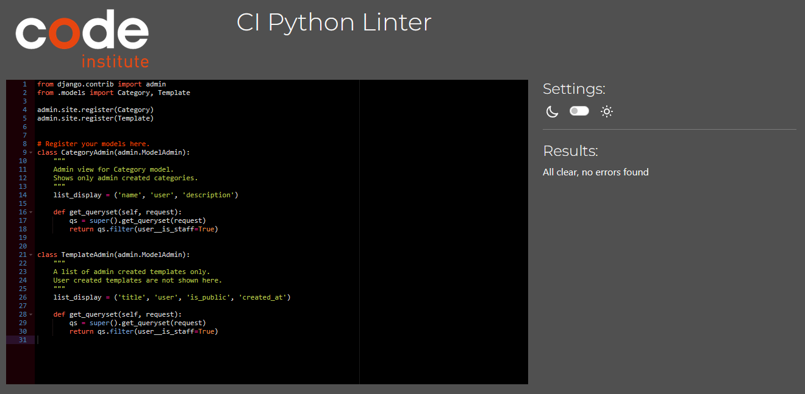 | 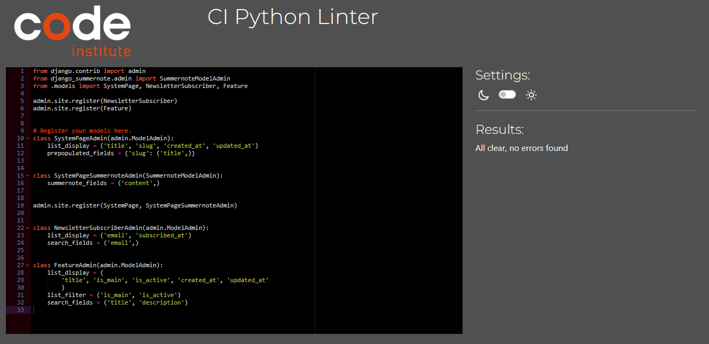 |

</details>


### Other Reports
Other validation reports for performance, accessibility, best practices, SEO, and CSS validation are provided below.

<details>
  <summary>Click to view Other Validations</summary>

* **Lighthouse Report for Performance, Accessibility, Best Practices, and SEO:** 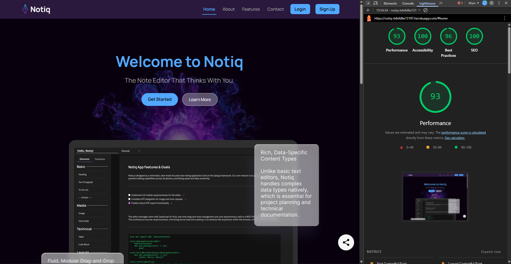

Autoprefixer was used for CSS vendor prefixes using PostCSS, due to modern techniques being used within the project, the CSS validation was done with CSSTree as the W3C CSS validator was not able to parse some of the newer CSS syntax.


* **Main CSS Validation:** 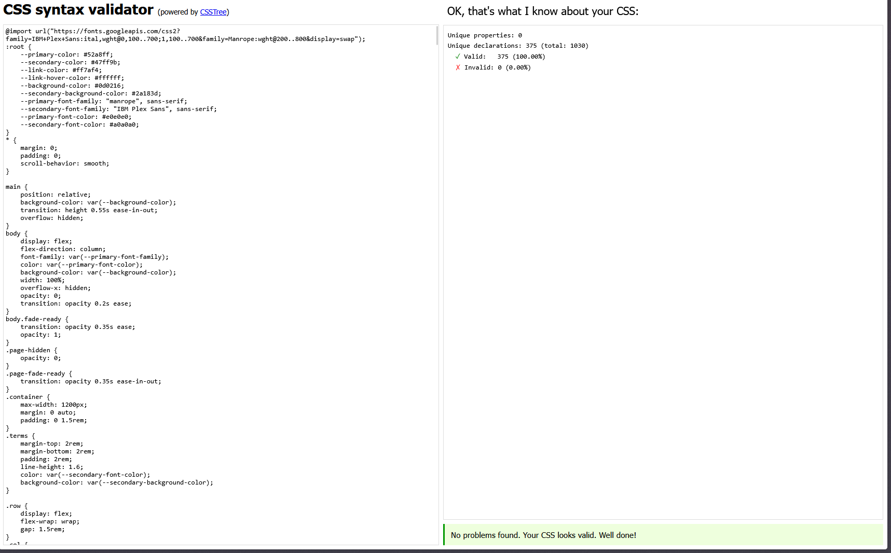
* **Notes App CSS Validation:** 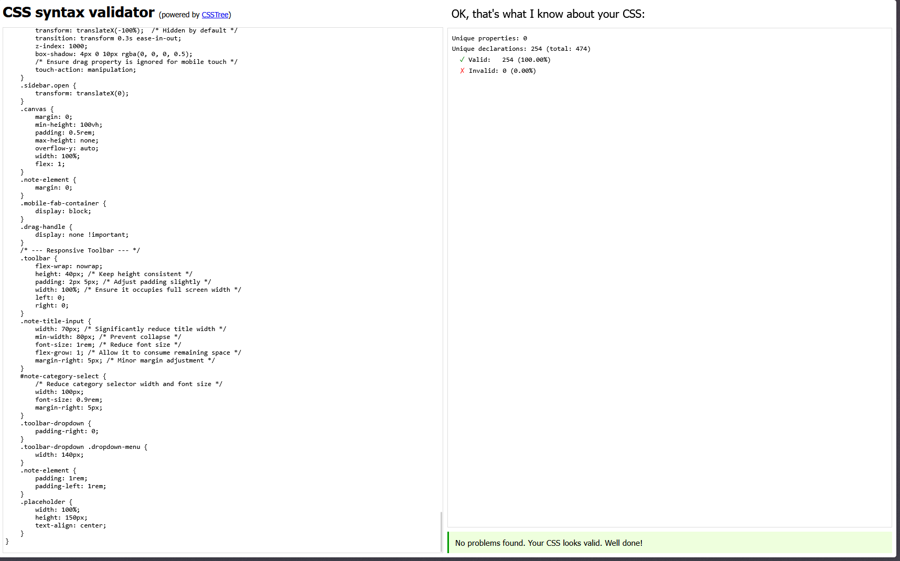

</details>


[↑ Back to Top](#table-of-contents)

---

## License

This project is licensed under the **MIT License**.

> Permission is hereby granted, free of charge, to any person obtaining a copy of this software and associated documentation files (the "Software"), to deal in the Software without restriction, including without limitation the rights to use, copy, modify, merge, publish, distribute, sublicense, and/or sell copies of the Software, and to permit persons to whom the Software is furnished to do so, subject to the following conditions:
>
> The above copyright notice and this permission notice shall be included in all copies or substantial portions of the Software.
>
> THE SOFTWARE IS PROVIDED "AS IS", WITHOUT WARRANTY OF ANY KIND, EXPRESS OR IMPLIED, INCLUDING BUT NOT LIMITED TO THE WARRANTIES OF MERCHANTABILITY, FITNESS FOR A PARTICULAR PURPOSE AND NONINFRINGEMENT. IN NO EVENT SHALL THE AUTHORS OR COPYRIGHT HOLDERS BE LIABLE FOR ANY CLAIM, DAMAGES OR OTHER LIABILITY, WHETHER IN AN ACTION OF CONTRACT, TORT OR OTHERWISE, ARISING FROM, OUT OF OR IN CONNECTION WITH THE SOFTWARE OR THE USE OR OTHER DEALINGS IN THE SOFTWARE.